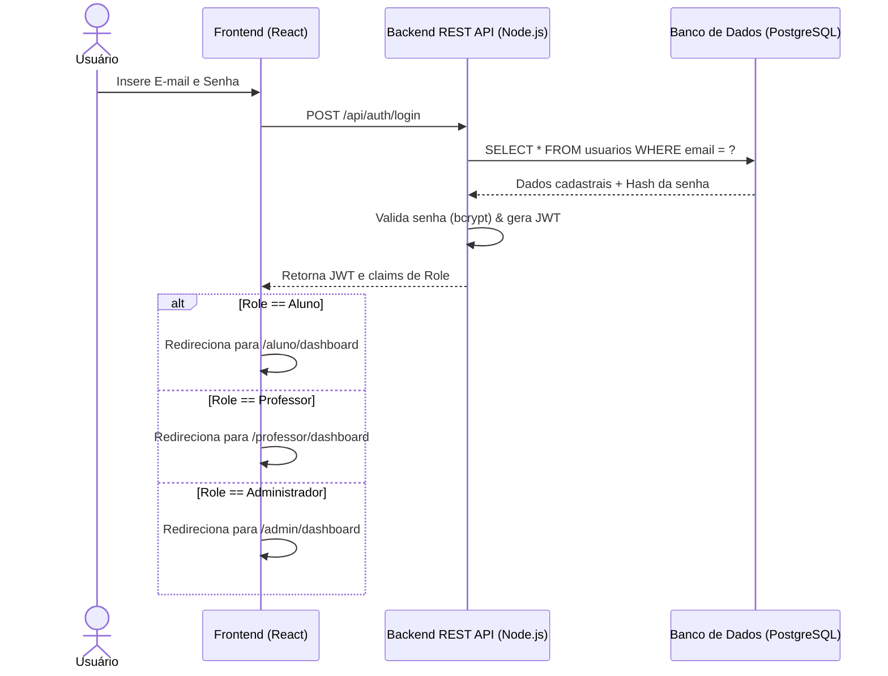
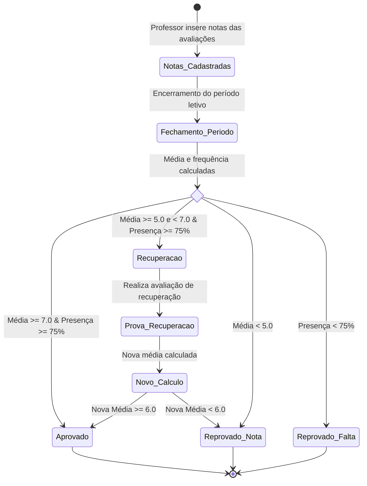
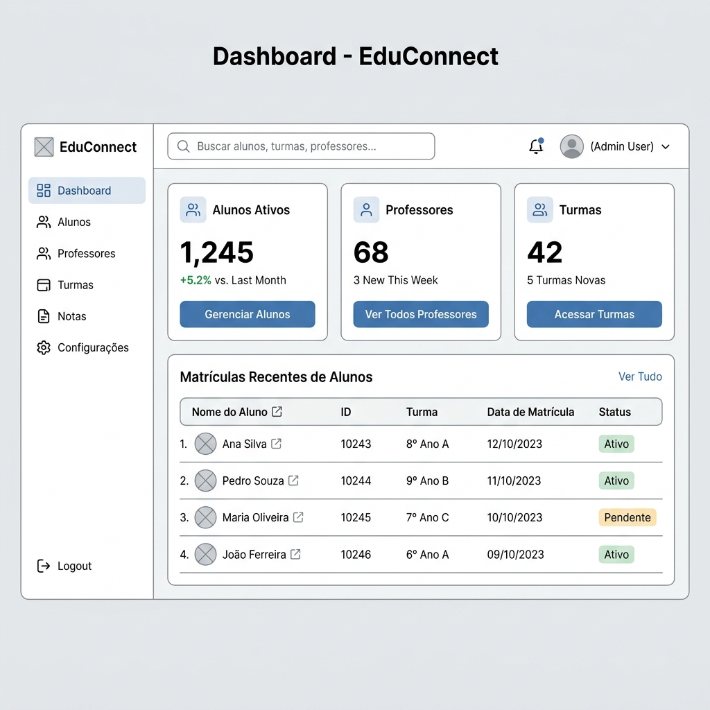

# EduConnect — Especificação de Requisitos e Levantamento do Sistema

---

## 1. Histórico de Revisões

| DATA | VERSÃO | DESCRIÇÃO DA ALTERAÇÃO | AUTOR |
| :--- | :--- | :--- | :--- |
| 26/06/2026 | 1.0.0 | Elaboração inicial e consolidação de requisitos da Etapa 1 | Equipe EduConnect |

* **Última Atualização:** 26/06/2026 15:12:00 (GMT-3)

---

## 2. Identificação dos Envolvidos

| PAPEL | NOME | EMAIL INSTITUCIONAL |
| :--- | :--- | :--- |
| **Product Owner (Líder)** | Ryan Nunes | ryan.nunes@educonnect.com.br |
| **Scrum Master** | Rafael Oschvat | rafael.oschvat@educonnect.com.br |
| **Tech Lead & UI/UX Designer** | Arthur Emmerich | arthur.emmerich@educonnect.com.br |
| **Software Architect & Backend Engineer** | Gabriel Garcia | gabriel.garcia@educonnect.com.br |
| **Systems Analyst & DevOps Engineer** | Nicollas Duarte | nicollas.duarte@educonnect.com.br |
| **Full Stack Developer & Database Admin** | Pedro Carvalho | pedro.carvalho@educonnect.com.br |

---

## 3. Visão Geral do Sistema

O **EduConnect** é uma plataforma integrada de gestão escolar e acadêmica projetada para centralizar o ecossistema de controle pedagógico de instituições de ensino. O sistema reúne no mesmo ambiente digital estudantes, docentes e o corpo administrativo para simplificar matrículas, acompanhar notas e frequência, gerenciar turmas e facilitar a comunicação diária.

### Logo e Identidade Visual
A identidade visual do EduConnect baseia-se na fusão conceitual de educação clássica e tecnologia digital. 
* **Design:** Um ícone vetorizado plano composto por um capelo (chapéu de formatura) estilizado em tons de gradiente azul-escuro e índigo, onde suas vértices se ramificam em nós de rede interconectados, simbolizando a integração digital do ensino.
* **Tipografia:** Fonte sem serifa moderna e limpa ("Outfit" ou "Inter"), transmitindo profissionalismo, acessibilidade e inovação tecnológica.

<p align="center">
  
</p>

---

## 4. Problema do Negócio

As instituições de ensino lidam diariamente com processos de gestão acadêmica ineficientes e suscetíveis a erros humanos devido aos seguintes fatores:
1. **Dados Descentralizados:** Planilhas desconexas, arquivos de papel e sistemas legados dificultam a consolidação de boletins e históricos escolares, elevando o tempo de atendimento e o overhead operacional.
2. **Excesso de Trabalho Manual:** Professores dedicam tempo excessivo ao lançamento manual de presenças em diários físicos e ao cálculo manual de médias finais ao final de cada período letivo.
3. **Falhas de Comunicação:** Estudantes e seus responsáveis não possuem um canal unificado em tempo real para visualizar faltas acumuladas, prazos de exames e avisos escolares de urgência.
4. **Vulnerabilidade de Auditoria:** A ausência de logs detalhados dificulta a identificação e rastreamento de alterações indevidas ou fraudulentas em notas e registros de presença de alunos.

---

## 5. Viabilidade Técnica

A análise de viabilidade técnica definiu as seguintes diretrizes para o desenvolvimento e operação do EduConnect:

* **Restrição Tecnológica Primária:** O sistema será desenvolvido utilizando **exclusivamente a stack JavaScript/TypeScript**, tanto na camada de apresentação (client-side) quanto na camada de processamento (server-side). Esta abordagem otimiza a curva de aprendizado da equipe, unifica o ecossistema de desenvolvimento e reduz o tempo de deploy.
* **Componentes de Stack Técnica:**
  * **Frontend:** Framework **React** (ou Next.js para controle de rotas dinâmicas e Server-Side Rendering), utilizando Vanilla CSS para estilização e micro-animações customizadas de alta performance.
  * **Backend:** Ambiente de execução **Node.js** implementado com framework **NestJS** (ou Express.js customizado), garantindo arquitetura limpa em camadas (Controllers, Services, Repositories) e tipagem forte com TypeScript.
  * **Banco de Dados:** Motor relacional **PostgreSQL** para assegurar consistência transacional forte (padrão ACID), controle de integridade referencial por chaves estrangeiras e agilidade em consultas complexas.
  * **Cache e Sessão (Opcional):** Instância de banco em memória **Redis** para caching de queries frequentes de leitura e gerenciamento de blocklists de tokens JWT inválidos.

---

## 6. SCRUM Framework

O EduConnect adota a metodologia ágil **Scrum** para guiar o ciclo de desenvolvimento do software. A estrutura organizacional é dividida nos seguintes papéis:

```
[ LÍDER / PRODUCT OWNER ] <=== Alinha escopo e prioridades ===> [ SCRUM MASTER ]
                                                                     |
                                                           Facilita e remove impedimentos
                                                                     |
                                                                     v
                                                            [ DEV TEAM ]
```

* **Líder (Product Owner):** Responsável por definir a visão do produto, construir e priorizar o Backlog do Produto (Product Backlog), validar as entregas ao término de cada Sprint e alinhar as expectativas do negócio com os requisitos do sistema.
* **Scrum Master:** Atua como facilitador do time, garantindo a aplicação correta dos ritos do Scrum, removendo impedimentos técnicos ou organizacionais que afetem a produtividade da equipe e blindando o time de interferências externas.
* **Team (Dev Team):** Equipe multidisciplinar e auto-organizada (engenheiros de software, designers de interface e analistas de QA) responsável por projetar, desenvolver, testar e publicar os incrementos funcionais a cada entrega.

### Fluxo de Trabalho (Ritos Ágeis)
1. **Sprint Planning:** Reunião no início de cada ciclo para definir o Objetivo da Sprint e selecionar os itens do backlog que serão desenvolvidos.
2. **Daily Scrum:** Reunião diária de alinhamento rápido (15 minutos) para identificar o progresso individual e eventuais impedimentos.
3. **Sprint Review:** Apresentação do incremento funcional desenvolvido durante a Sprint para o Product Owner e stakeholders para validação.
4. **Sprint Retrospective:** Reunião pós-review com o time para analisar pontos positivos, falhas operacionais e criar ações corretivas para a Sprint subsequente.

---

## 7. Planejamento de Sprints

O desenvolvimento completo do EduConnect é estruturado em **4 Sprints consecutivas**, com duração fixa de **1 mês por Sprint**, totalizando 4 meses de cronograma de projeto:

```mermaid
gantt
    title Planejamento de Sprints (EduConnect)
    dateFormat  YYYY-MM-DD
    section Sprints
    Sprint 1 : Infraestrutura & Autenticação   :active, des1, 2026-07-01, 30d
    Sprint 2 : Matrículas & Cadastro          :des2, after des1, 30d
    Sprint 3 : Módulos Acadêmicos             :des3, after des2, 30d
    Sprint 4 : Relatórios, Cache & Auditoria   :des4, after des3, 30d
```

### Sprint 1: Fundação, Infraestrutura e Autenticação (Mês 1)
* **Objetivo:** Estabelecer a infraestrutura de banco de dados PostgreSQL, estruturar o boilerplate do backend NestJS e frontend React, e finalizar o módulo de controle de acesso (RBAC) com autenticação baseada em tokens JWT.
* **Entregável:** Sistema de login funcional com perfis mapeados (Aluno, Professor, Administrador) e banco de dados modelado.

### Sprint 2: Matrículas e Cadastro de Usuários (Mês 2)
* **Objetivo:** Desenvolver os fluxos de CRUD (criação, leitura, atualização e exclusão) administrados pelo perfil Administrador, incluindo cadastro de novos alunos, docentes, parametrização de disciplinas e alocação física de salas de aula.
* **Entregável:** Painel do administrador operacional permitindo a vinculação inicial de turmas e matrículas.

### Sprint 3: Lançamento de Notas e Chamada Digital (Mês 3)
* **Objetivo:** Implementar o núcleo pedagógico do sistema. Habilitar a interface do professor para registro diário de faltas e inserção de notas. Desenvolver o painel do aluno para acompanhamento de boletins, gráficos de frequência e download de materiais didáticos.
* **Entregável:** Módulo completo de avaliações e chamadas operando em tempo real.

### Sprint 4: Relatórios, Otimização e Auditoria (Mês 4)
* **Objetivo:** Integrar os serviços de auditoria de logs para operações sensíveis, implementar a camada de cache Redis para rotas críticas de leitura pesada, finalizar a emissão de relatórios consolidados em formato PDF e conduzir os testes de estresse de carga.
* **Entregável:** Sistema otimizado com cache, auditoria funcional e relatórios gerados.

---

## 8. Funcionalidades do Sistema

### Aluno
* **Visualização de Boletim:** Consulta consolidada às notas de provas, trabalhos e médias de cada disciplina no ano letivo.
* **Acompanhamento de Frequência:** Monitoramento em tempo real do número de presenças, faltas e o cálculo percentual de assiduidade.
* **Grade e Quadro Horário:** Visualização do cronograma semanal de aulas com indicação de salas e professores.
* **Acesso a Materiais:** Área de download para obter PDFs, slides e diretrizes didáticas publicadas pelos docentes.

### Professor
* **Lançamento de Notas:** Inserção, edição e exclusão de notas de avaliações parciais, exames e avaliações substitutivas.
* **Diário de Classe (Chamada):** Interface otimizada para registro de faltas e presenças de alunos em turmas ativas sob sua responsabilidade.
* **Publicação de Conteúdo:** Envio de arquivos pedagógicos e links de apoio associados ao plano de ensino.
* **Cadastro de Cronograma de Avaliações:** Definição de datas de avaliações, entrega de projetos e trabalhos.

### Administrador
* **Gestão de Cadastro e Matrícula:** Controle de cadastro, inativação e suspensão de registros de alunos, professores e novos administradores.
* **Parametrização Acadêmica:** Criação de novos anos escolares, bimestres, salas físicas, turmas e matrizes de disciplinas curriculares.
* **Vínculo Docente:** Atribuição de professores titulares e substitutos para turmas específicas.
* **Geração de Relatórios Consolidados:** Emissão de boletins completos de turmas, análise de taxas de evasão e relatórios de assiduidade institucional.
* **Acesso a Logs de Auditoria:** Painel de rastreabilidade de modificações de sistema (como alteração retroativa de notas).

---

## 9. Regras de Negócio

* **RN01 — Frequência Mínima de Aprovação:** O estudante deve registrar frequência acumulada igual ou **superior a 75%** das horas letivas totais de uma disciplina para obter aprovação direta. O descumprimento gera reprovação por falta automática.
* **RN02 — Média de Notas para Aprovação:**
  * O aluno com **média aritmética final maior ou igual a 7.0** é classificado como **Aprovado**.
  * O aluno com **média aritmética final entre 5.0 e 6.9** é elegível para realizar a **Prova de Recuperação**.
  * O aluno com **média aritmética final inferior a 5.0** é classificado como **Reprovado por Nota** direto.
* **RN03 — Exclusividade de Matrícula:** Um estudante não pode ser matriculado em mais de uma turma no **mesmo ano letivo e turno**.
* **RN04 — Prazo Limite para Notas:** Professores dispõem de no máximo **10 dias corridos** (contados a partir da data de aplicação do exame) para lançar ou retificar as notas dos alunos na plataforma. Decorrido o prazo, a nota é bloqueada e necessita de autorização administrativa para alteração.
* **RN05 — Restrição de Capacidade de Sala:** O número máximo de matrículas ativas vinculadas a uma turma física é estritamente limitado à capacidade da sala parametrizada no banco de dados (padrão de **40 alunos**).
* **RN06 — Unicidade de Usuário:** Os registros de usuários no banco de dados exigem a **validação única de CPF e e-mail**. Cadastros redundantes com mesmos dados de identificação serão rejeitados pela camada de API.
* **RN07 — Alteração Retroativa de Presença:** O lançamento e a edição de chamadas escolares por professores são restritos a um período limite de **48 horas úteis** após a data de realização da aula.

---

## 10. Fluxo do Sistema

### Fluxo de Autenticação e Autorização (RBAC)



### Ciclo de Lançamento de Notas e Aprovação



---

## 11. Requisitos Funcionais (RF)

* **RF001:** O sistema deve validar a identidade de usuários através de um **login seguro com autenticação baseada em JWT**.
* **RF002:** O sistema deve aplicar controle de **acesso baseado em perfis (RBAC)** para segregar permissões entre Alunos, Professores e Administradores.
* **RF003:** O sistema deve fornecer painéis para o administrador realizar o **cadastro e inativação de estudantes e docentes**.
* **RF004:** O sistema deve permitir ao administrador a **criação de turmas, disciplinas e alocação de salas**.
* **RF005:** O sistema deve possibilitar a **vinculação de professores às suas respectivas turmas e disciplinas**.
* **RF006:** O sistema deve permitir que os professores realizem o **lançamento de notas das avaliações** acadêmicas de suas turmas.
* **RF007:** O sistema deve prover um diário digital para o **registro de faltas e presenças** nas aulas pelos professores.
* **RF008:** O sistema deve executar de forma automatizada o **cálculo da média aritmética** e atualizar o status acadêmico do discente.
* **RF009:** O sistema deve disponibilizar ao estudante a **visualização do boletim e do histórico de assiduidade**.
* **RF010:** O sistema deve viabilizar ao docente fazer **upload de arquivos didáticos** associados às aulas e turmas.
* **RF011:** O sistema deve permitir que os administradores realizem a **emissão de relatórios acadêmicos em formato PDF**.
* **RF012:** O sistema deve gerar uma **trilha de auditoria (logs)** identificando alterações de notas e frequência (autor, data, valor anterior e novo).

---

## 12. Requisitos Não Funcionais (RNF)

* **RNF001 — Tempo de Resposta (Performance):** Transações de leitura comuns de boletins e frequências devem responder em **tempo inferior a 200ms sob volumetria de 1.000 requisições simultâneas**.
* **RNF002 — Hashing de Senhas (Segurança):** Todas as credenciais de acesso devem ser criptografadas de forma irreversível no banco de dados utilizando **bcrypt com fator de custo de criptografia igual ou superior a 12 (salt rounds)**.
* **RNF003 — Protocolo de Comunicação (Segurança):** Toda a transmissão de pacotes de dados pela rede deve ser cifrada utilizando o **protocolo seguro HTTPS sob especificação TLS 1.3**.
* **RNF004 — Taxa de Disponibilidade (Disponibilidade):** A plataforma deve garantir taxa mínima de **uptime de 99.9% anual (SLA)**, operando com arquitetura sem estado (stateless) distribuída por balanceadores de carga.
* **RNF005 — Concorrência de Bancos de Dados (Escalabilidade):** O banco de dados PostgreSQL deve operar com pool de conexões otimizado para tolerar pelo menos **10.000 requisições concorrentes por segundo** sem vazamento de memória ou travamentos (deadlocks).
* **RNF006 — Políticas de Backup (Disponibilidade):** O banco de dados de produção deve executar **backups incrementais automatizados de hora em hora** e backup completo (full backup) diariamente para replicação distribuída geograficamente.
* **RNF007 — Validação e Limitação de Requisições (Segurança):** A API do sistema deve implementar políticas de **Rate Limiting configuradas para barrar picos superiores a 100 requisições por minuto por IP** de origem, protegendo as rotas de força bruta e DoS.

---

## 13. Wireframe

O layout conceitual abaixo ilustra o arranjo estrutural das informações e recursos do EduConnect para telas de visualização em navegadores de desktops.

<p align="center">
  
</p>

### Layout da Dashboard Acadêmica (Estrutura Textual)

```
+------------------------------------------------------------------------------------+
|  [Logo EduConnect]             Pesquisa...                       [Nome do Usuário] |
+------------------------------------------------------------------------------------+
|  [Menu Lateral]   |  Painel Geral > Dashboard                                      |
|  * Dashboard      |  +-------------------+  +------------------+  +-------------+  |
|  * Notas          |  |  Média Geral      |  |  Frequência      |  | Avisos      |  |
|  * Presença       |  |  8.2 / 10.0       |  |  92%             |  | 2 Novos     |  |
|  * Grade Horária  |  +-------------------+  +------------------+  +-------------+  |
|  * Materiais      |                                                                |
|  * Sair           |  [Tabela de Disciplinas Recentes]                              |
|                   |  +-------------------+------------+------------+------------+  |
|                   |  | Disciplina        | Média Par. | Faltas     | Status     |  |
|                   |  +-------------------+------------+------------+------------+  |
|                   |  | Matemática I      | 8.5        | 4          | Aprovado   |  |
|                   |  | Programação Web   | 9.0        | 2          | Aprovado   |  |
|                   |  | Banco de Dados II | 6.2        | 6          | Recuperac. |  |
|                   |  +-------------------+------------+------------+------------+  |
+------------------------------------------------------------------------------------+
```

---

## 14. Glossário

* **RBAC (Role-Based Access Control):** Mecanismo de controle de acesso de segurança onde privilégios do usuário dentro do sistema são diretamente atrelados ao seu papel institucional (Aluno, Professor, Administrador).
* **JWT (JSON Web Token):** Token baseado em JSON assinado criptografadamente, transmitido entre cliente e servidor para autenticação stateless sem necessidade de manter sessões em memória no backend.
* **ACID (Atomicity, Consistency, Isolation, Durability):** Propriedades essenciais de transações que asseguram a integridade de dados e operações no banco PostgreSQL.
* **SLA (Service Level Agreement):** Métrica de acordo operacional que garante o nível mínimo aceitável de desempenho e disponibilidade do serviço.
* **TTL (Time-To-Live):** Configuração em milissegundos ou segundos que determina por quanto tempo um registro de cache Redis permanecerá em memória rápida antes de ser invalidado.
* **Stateless:** Design de microsserviços e APIs web onde o servidor de aplicação não guarda histórico de contexto de requisições de clientes anteriores, viabilizando auto-scaling imediato.

---

## 15. ÍNDICE FINAL

1. [Histórico de Revisões](#1-historico-de-revisoes)
2. [Identificação dos Envolvidos](#2-identificacao-dos-envolvidos)
3. [Visão Geral do Sistema](#3-visao-geral-do-sistema)
4. [Problema do Negócio](#4-problema-do-negocio)
5. [Viabilidade Técnica](#5-viabilidade-tecnica)
6. [SCRUM Framework](#6-scrum-framework)
7. [Planejamento de Sprints](#7-planejamento-de-sprints)
8. [Funcionalidades do Sistema](#8-funcionalidades-do-sistema)
9. [Regras de Negócio](#9-regras-de-negocio)
10. [Fluxo do Sistema](#10-fluxo-do-sistema)
11. [Requisitos Funcionais (RF)](#11-requisitos-funcionais-rf)
12. [Requisitos Não Funcionais (RNF)](#12-requisitos-nao-funcionais-rnf)
13. [Wireframe](#13-wireframe)
14. [Glossário](#14-glossario)
15. [ÍNDICE FINAL](#15-indice-final)
